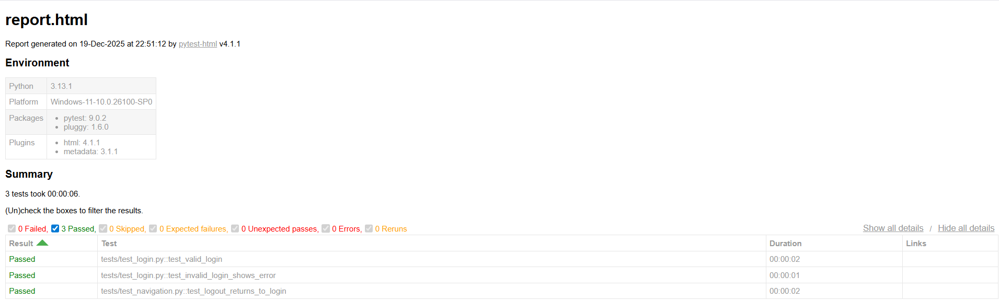
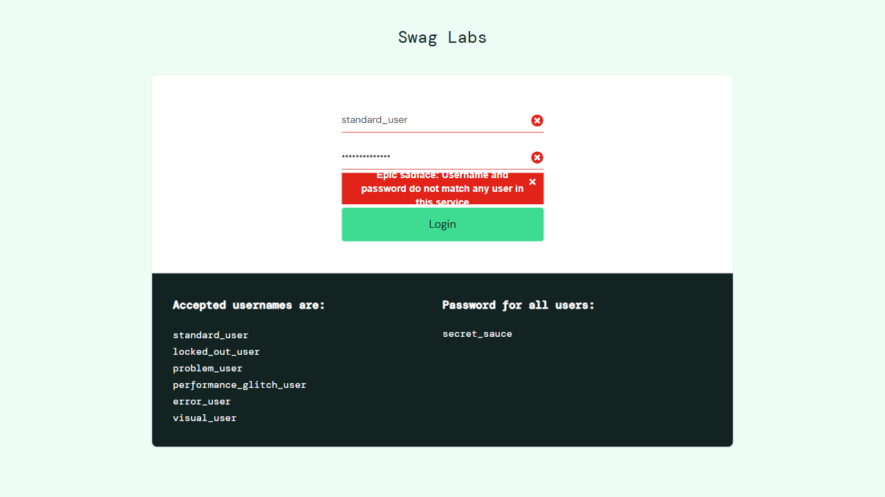

# QA Web Framework – Playwright + Pytest

## 📌 Descripción
Proyecto de **QA Automation enfocado en la automatización de pruebas web** mediante la construcción de un **mini framework** utilizando **Playwright** y **Pytest**.  
Se validan flujos críticos de una aplicación web aplicando buenas prácticas como **Page Object Model (POM)**, **fixtures**, **configuración centralizada** y **generación de reportes automáticos**.

## ⭐ Características / Features Clave
- Framework de automatización web con Playwright + Pytest
- Implementación de Page Object Model (POM)
- Uso de fixtures para manejo de browser y contextos
- Configuración centralizada
- Ejecución en modo headless o visible
- Generación automática de reportes HTML
- Captura automática de screenshots en fallos

## 🧪 Qué se está probando
- Flujo de login con credenciales válidas
- Manejo de errores en login con credenciales inválidas
- Navegación post-login
- Flujo de logout y retorno a la pantalla de autenticación
- Validación de carga correcta del dashboard

## 🛠 Stack Tecnológico
- Python
- Pytest
- Playwright
- pytest-html
- Navegador Chromium

## 📂 Estructura del Proyecto
```
qa-web-framework-playwright/
├── pages/
│ ├── base_page.py
│ ├── login_page.py
│ └── dashboard_page.py
├── tests/
│ ├── test_login.py
│ └── test_navigation.py
├── utils/
│ └── config.py
├── reports/
│ ├── report.png
│ └── screenshots/
│   └── example_failure.png
├── conftest.py
├── pytest.ini
├── requirements.txt
├── .gitignore
└── README.md
```
- `pages/`: contiene los Page Objects siguiendo el patrón POM  
- `tests/`: contiene los tests automatizados  
- `utils/`: configuración centralizada del proyecto  
- `reports/`: evidencia de ejecución (reporte visual y screenshots) 
- `conftest.py`: fixtures y hooks globales de Pytest  
- `pytest.ini`: configuración global de Pytest  

## ▶️ Cómo ejecutar el proyecto
```powershell
# Clonar el repositorio e ingresar al proyecto
git clone https://github.com/Matiaslb14/qa-web-framework-playwright.git
cd qa-web-framework-playwright

# Crear y activar entorno virtual
python -m venv .venv
.\.venv\Scripts\Activate.ps1

# Instalar dependencias
pip install -r requirements.txt
playwright install

# Ejecutar los tests (modo headless)
pytest
```
Para ejecutar los tests con navegador visible:
```powershell
$env:HEADLESS="false"; pytest
```

## ✅ Escenarios automatizados
- Login exitoso con credenciales válidas
- Login fallido con validación de mensaje de error
- Validación de carga del dashboard
- Logout correcto y retorno a la pantalla de login

## 🧠 Decisiones técnicas
- Se utiliza **Page Object Model** para mejorar mantenibilidad y escalabilidad
- Las credenciales y URL base están centralizadas en un archivo de configuración
- Se emplean **fixtures de Pytest** para el manejo del navegador y los contextos de ejecución.
- Los tests se ejecutan en modo headless por defecto para facilitar su automatización.
- Se generan reportes HTML y screenshots automáticos como evidencia ante fallos.

## 📊 Reportes / Evidencia (cuando aplique)

### Reporte HTML de ejecución


### Screenshot automático en fallo


## 📈 Mejoras futuras
- Integración con CI/CD mediante GitHub Actions
- Ejecución mediante Docker
- Soporte para múltiples navegadores
- Data-driven testing
- Integración de pruebas de API dentro del mismo framework
